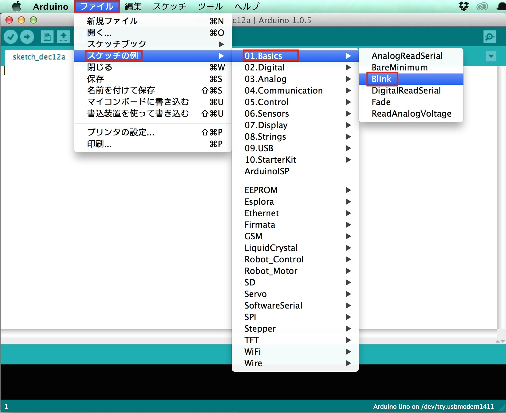
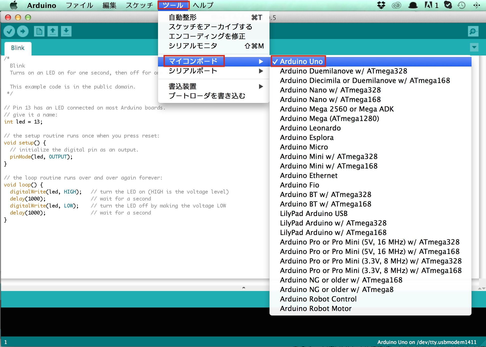
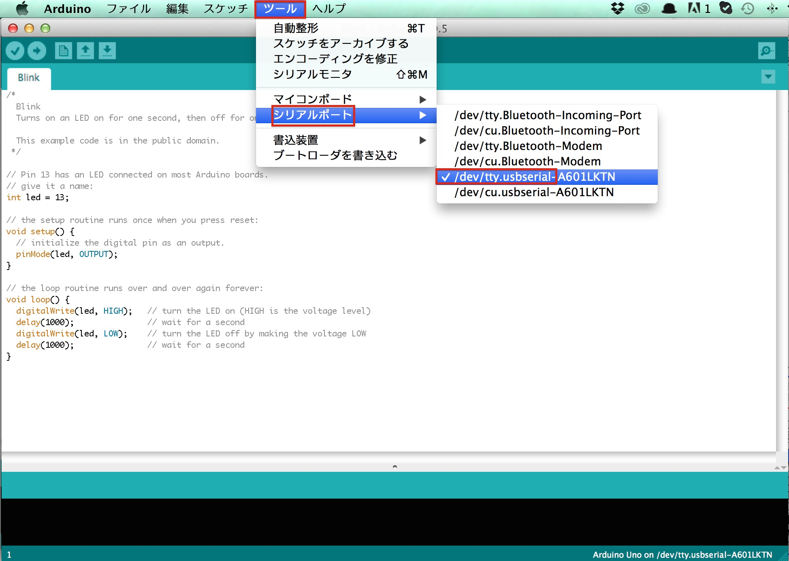
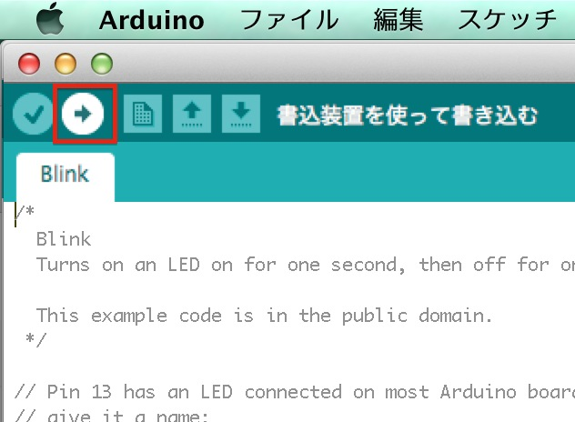

# マイコンへの書込み

###準備
RomライターシールドをArduinoUnoに差し込む。

PCに接続

スケッチを選択　ファイル→スケッチブックの例→ArduinoISP→ArduinoISP
スケッチを書き込む ツール→書込装置→Arduino as ISP→Arduino as ISP
ブートローダーを書き込む　ツールブートローダーを書き込む

エラーメッセージ


ArduinoIDEを起動し、メニューより、[ファイル]→[スケッチの例]→ [1.Basics]→[Blink]を選択します。
<br>


メニューより[ツール]→[マイコンボード]→[Arduino Uno]を選択します。
<br>



メニューの[ツール]→[シリアルポート]→[/dev/tty.usbserial-◯◯]を選択します。
<br>



画面左上の「→」ボタンを押すと書き込みが行われます。
画像では「書込装置を使って書き込む」と書いてありますが、実際は「マイコンボードに書込む」が表示されます。
<br>



ここでエラーがでなければ完了です。

書き込み時にエラーとなる場合、一度配線を見直して下さい。

<br>

#### 動作確認

書込みが完了するとArduinoに書込んだプログラムは自動で動き出します。
スケッチ内の以下の箇所の数値を変更し、点滅の早さが変わる事を確認してみてください。
```
delay(1000);
```

次にUSBを取り外し、電池接続でも同じように動作するかを確認してみましょう。
