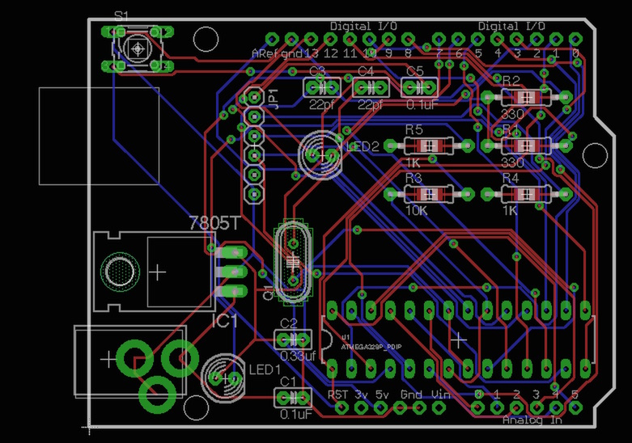

# レイアウト

基板のレイアウトを作成していきます。

画面左上の「Generate/switch to board」をクリックします。

 

 

黒い画面が表示され、部品が配置されます。
 

 

ツールバーより「Move」を選択します。
 

 

基板の左下にある「＋」をクリックします。
 

 

基板の更に右側に、四角い枠があるので、そこの左下の「＋」をクリックすることで基板が移動します。
 

 

ツールバーより「Delete」を選択します。
 

 

四角い枠の線を１本ずつ消して行きます。
まずは上を削除します。
 

 

左側
 

 

下側
 

 

右側
 
これで全て削除できました。
 

 
次に基板の枠を作成します。
 
ツールバーより「Wire」を選択すると左上に「1 Top」のような文字が表示されます。
これはレイヤーというもので、ここで線の種類を変更することができます。
 
今回はそのレイヤーの内、基板の外枠を示す「20 Dimension」を選択します。
 

 

基板の外枠に沿って線を引きます。
 
左下の「＋」部分から時計回りに線を引いて行きます。
 
線は斜めに引く事ができないため、下の図の様に引きます。
 

 

斜めの線に変形させるために「split」を選択します。
 

splitの使い方
 

 

 

 

 

 

 

 

 

 

 

 

 

 

 

 

 

 

 

 

 

 

 

