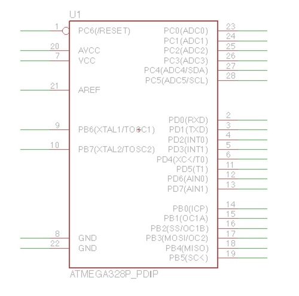

# マイコンの配置

Arduino Unoで使用されている「ATMEGA328P」を配置します。

ATMEGA328P
 
[データシート](
http://www.atmel.com/images/Atmel-8271-8-bit-AVR-Microcontroller-ATmega48A-48PA-88A-88PA-168A-168PA-328-328P_datasheet_Complete.pdf)

## ATMEGA328の配置

ATMEGA328Pを配置します。
 
ツールバーのAddを選択し、ATMEGA*で検索を行い、「ATMEGA328P_PDIP」を選択します。
 

 

ATMEGA328Pは空いている箇所に配置します。
 
少し余裕を持って配置すると良いです。
 

 

 

 

 

 

ATMEGA328Pのデータシート

線を引き線にラベル名をつける

ラベル名の変更

ATMEGA 328Pの説明

|1|2|3|4|5|6|7|8|9|10|11|12|13|14|
|--|--|--|--|--|--|--|--|--|--|--|--|--|
|Re|D0|D1|D2|D3|D4|5V   |GND|XTAL|XTAL|D5|D6|D7|D8|
|15|16|17|18|19|20|21|22|23|24|25|26|27|28|
|D9|D10|D11|D12|D13|5V|外|GND|A0|A1|A2|A3|A4|A5|

Re：Reset
 
外：外部電源
 
5V：5V入力

GND

線のラベル名がGNDになっているのですでにつながっています。

5V電源

VCC, AVCCを5Vに接続します。

